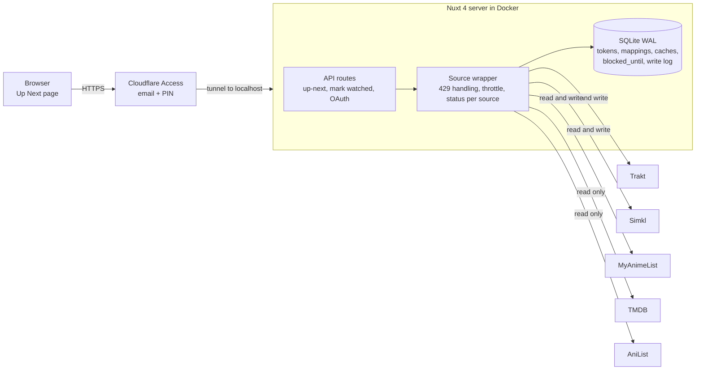

# Tsuzuku: Project Plan

Decisions live in [decisions.md](decisions.md). Work is tracked in the GitHub project.

## Overview

A self-hosted web app that shows what to watch next across Trakt, Simkl and MyAnimeList, and makes disagreements between them visible. It fetches live, keeps no full copy of any library, and never changes a source without a preview and a manual confirm.

- **Scope v1:** shows and anime. Movies later, manga out.
- **User:** you only, with a `user_id` column kept in every table.
- **Core idea:** one row per show, one column per source, each with its own title, progress and next episode.

## Architecture

One Nuxt 4 server in a container brokers everything. The browser reaches it only through Cloudflare Access, and it reaches the five external APIs only through the source wrapper.

Stack: Nuxt 4 (Vue, Nitro), Nuxt UI, SQLite in WAL mode with Drizzle, Docker Compose, Cloudflare tunnel. The server binds to 127.0.0.1; the wrapper is the single place that handles status, 429s and throttling.

## Data model

SQLite stores only what live calls cannot: tokens, mappings, cached metadata and source state. Watch progress is never stored as truth; it is fetched on open and cached briefly.

| Table | Purpose | Key columns |
| --- | --- | --- |
| `source_accounts` | One row per connected source | `user_id`, `source`, encrypted access and refresh token, `expires_at`, `blocked_until`, `last_status`, `last_fetch_at` |
| `mappings` | One row per linked show | `user_id`, Trakt, Simkl, MAL, TMDB, AniList IDs, `kind` (show or anime), `status` (auto, confirmed, rejected) |
| `mapping_seasons` | Anime season to MAL/AniList entry | `mapping_id`, `trakt_season`, `mal_id`, `anilist_id`, `episode_offset`, `episode_count` |
| `rejected_candidates` | Candidates you declined | `user_id`, `source`, `source_item_id`, `candidate_id` |
| `metadata_cache` | TMDB and AniList responses | `provider`, `external_id`, JSON, `fetched_at` |
| `fetch_cache` | Last list per source | `user_id`, `source`, JSON, `fetched_at` |
| `write_log` | Every confirmed write | `user_id`, `source`, `item`, `action`, `result`, `at` |

Back up with `sqlite3 .backup` or Litestream, not a raw file copy during writes. Keep the token encryption key outside the database and back it up separately.

## Source adapters and rate limits

Each source sits behind one wrapper that returns `{status, data, fetchedAt, retryAfter}`. One source failing never blanks the page: the three fetches run with `Promise.allSettled`.

| Source | Watching list | Write "mark next" | Notes |
| --- | --- | --- | --- |
| Trakt | `GET /sync/progress/up_next?extended=full&sort_how=desc` (OAuth, paginated) | Add episode to history | `extended=full` gives TMDB/TVDB IDs, `last_watched_at` and the next episode. Hidden shows are excluded. |
| Simkl | `/sync/activities`, then `/sync/all-items/{shows,anime}/watching` once and `date_from` deltas after | Add episode to history | Returns cross-IDs (MAL, TMDB, IMDb, TVDB). Must check activities first or the client ID gets suspended. |
| MAL | `GET /users/@me/animelist?status=watching` | Increment watched count by 1; set completed on the last episode | Count only, no per-episode dates. Access tokens last 31 days. |

"Fetch live" means one call per source on open. For Simkl that call is `/sync/activities`; the lists are fetched only when it shows a change, and the cached list is served otherwise. Raw responses are kept in `fetch_cache` (`GET /api/sources/watching` returns them).

**Rate limit handling**

1. On a 429, read `Retry-After`, save `blocked_until` for that source, and stop calling it.
2. Serve cached data with a "stale, fetched N min ago" badge. Never show it as "missing".
3. Disable write buttons for that source; the preview shows "blocked, retry in 42s".
4. Auto-retry once when the countdown ends, plus a manual Refresh button.
5. A small in-memory token bucket per source avoids most 429s.

**Status chip per source:** ok, rate limited (countdown), auth expired, error. A source with a failed token refresh shows "auth expired" and a Reconnect button.

## Mapping

A show is linked across sources in two layers, and you confirm every uncertain link once.

1. **Deterministic first.** Shared IDs: Trakt and Simkl return TMDB/IMDb/TVDB; Simkl and AniList (`idMal`) bridge to MAL.
2. **Ranked candidates.** For an unmatched item, search the target source by title (English, romaji, Japanese) and rank by title and year match. You confirm with one tap. The result is cached permanently; rejected candidates are stored so they are not suggested again.
3. **Laya later.** The ranking step is the only part Laya replaces. Plan: build a labeled set from the deterministic matches, benchmark Laya zero-shot, fine-tune the multilingual checkpoint if weak, and keep the non-AI verifier (year, type, episode count) after the model.

**Anime seasons.** Trakt has one show with seasons; MAL has one entry per season or cour. For anime, `mapping_seasons` links each Trakt season to a MAL/AniList entry with an `episode_offset` (for example Trakt S1E26 = MAL entry 2, episode 1). AniList sequel and prequel relations propose the chain; you confirm. Other shows link at show level only.

**Unmapped is not missing.** The UI separates "not in that list" from "unmapped", so a failed link never looks like an absent show.

## UI and write flow

**Up Next page** (`/`). Main list in Trakt `up_next` order, then a separate "Not in Trakt up next" section: Simkl and MAL watching shows that are unlinked, or linked to a Trakt show Trakt does not list as up next. Shows with something to watch come first, caught-up ones after (collapsed, not hidden), each by its own last activity.

Each row has one column per source showing:

- that source's own title and entry (MAL shows the entry title plus episode count, so season splits are visible)
- progress, for example "S2E5" or "7/12"
- its own next episode
- a state: in sync, differs, caught up, not in that list, unmapped, stale, or blocked

No source is treated as correct, and no "next episode" is computed across sources. Differences are highlighted and left for you.

Every title, season and episode links to that source's page; entries that Simkl and MAL both list are labelled "Simkl + MAL", and their values are shown separately when they differ (decision #24).

**Caught-up rows** (#62) say when the next episode airs, per source that knows, side by side: Trakt's `next_episode` for a linked Trakt show (cached a day, or until it airs) and AniList's `nextAiringEpisode` for anime (part of the existing AniList lookup, fetched again once a cached date has passed). Only the Up Next page asks, never the write path.

**Calendar** (#72): `/calendar`, read-only, last month to next month. Trakt's own calendar of your shows (not cut down to Up Next: Trakt drops caught-up shows from up next, and those are the ones airing), AniList's airing schedule for the anime on Up Next, and Simkl's date for your next episode (anime: a Japan-time calendar date, shown on that date as written). Each item is one source's own title, episode and date, linked to that source; one show's items sit together, so different dates for one episode show side by side. Faded when watched on that source's side (Trakt: before up next's next episode; anime: within the MAL count, else Simkl's). Month grid on wide screens, an agenda from today on narrow ones. Up Next rows come from the cached lists, so opening the calendar costs one Trakt and one AniList call per month, cached 6 hours.
