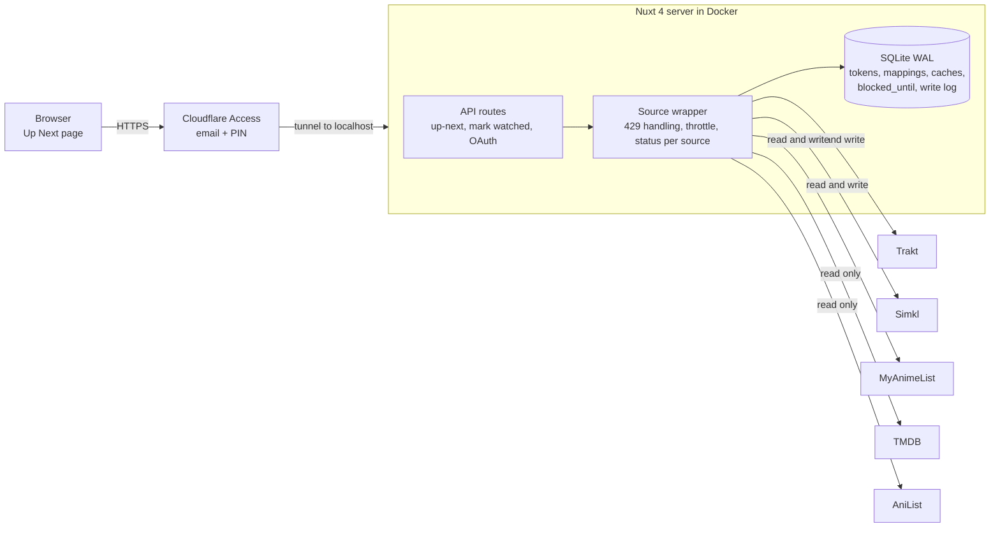

# Tsuzuku: Project Plan

Decisions live in [decisions.md](decisions.md). Work is tracked in the GitHub project.

## Overview

A self-hosted web app that shows what to watch next across Trakt, Simkl and MyAnimeList, and makes disagreements between them visible. It fetches live, keeps no full copy of any library, and never changes a source without a preview and a manual confirm.

- **Scope v1:** shows and anime. Movies later, manga out.
- **User:** you only, with a `user_id` column kept in every table.
- **Core idea:** one row per show, one column per source, each with its own title, progress and next episode.

## Architecture

One Nuxt 4 server in a container brokers everything. The browser reaches it only through Cloudflare Access, and it reaches the five external APIs only through the source wrapper.



Stack: Nuxt 4 (Vue, Nitro), Nuxt UI, SQLite in WAL mode with Drizzle, Docker Compose, Cloudflare tunnel. The server binds to 127.0.0.1; the wrapper is the single place that handles status, 429s and throttling.

## Data model

SQLite stores only what live calls cannot: tokens, mappings, cached metadata and source state. Watch progress is never stored as truth; it is fetched on open and cached briefly.

| Table | Purpose | Key columns |
| --- | --- | --- |
| `source_accounts` | One row per connected source | `user_id`, `source`, encrypted access and refresh token, `expires_at`, `blocked_until`, `last_status`, `last_fetch_at` |
| `mappings` | One row per linked show | `user_id`, Trakt, Simkl, MAL, TMDB, AniList IDs, `kind` (show or anime), `status` (auto, confirmed, rejected) |
| `mapping_seasons` | Anime season to MAL/AniList entry | `mapping_id`, `trakt_season`, `mal_id`, `anilist_id`, `episode_offset`, `episode_count` |
| `rejected_candidates` | Candidates you declined | `user_id`, `source`, `source_item_id`, `candidate_id` |
| `metadata_cache` | TMDB and AniList responses | `provider`, `external_id`, JSON, `fetched_at` |
| `fetch_cache` | Last list per source | `user_id`, `source`, JSON, `fetched_at` |
| `write_log` | Every confirmed write | `user_id`, `source`, `item`, `action`, `result`, `at` |

Back up with `sqlite3 .backup` or Litestream, not a raw file copy during writes. Keep the token encryption key outside the database and back it up separately.

## Source adapters and rate limits

Each source sits behind one wrapper that returns `{status, data, fetchedAt, retryAfter}`. One source failing never blanks the page: the three fetches run with `Promise.allSettled`.

| Source | Watching list | Write "mark next" | Notes |
| --- | --- | --- | --- |
| Trakt | `GET /sync/progress/up_next?extended=full&sort_how=desc` (OAuth, paginated) | Add episode to history | `extended=full` gives TMDB/TVDB IDs, `last_watched_at` and the next episode. Hidden shows are excluded. |
| Simkl | `/sync/activities`, then `/sync/all-items/{shows,anime}/watching` once and `date_from` deltas after | Add episode to history | Returns cross-IDs (MAL, TMDB, IMDb, TVDB). Must check activities first or the client ID gets suspended. |
| MAL | `GET /users/@me/animelist?status=watching` | Increment watched count by 1; set completed on the last episode | Count only, no per-episode dates. Access tokens last 31 days. |

"Fetch live" means one call per source on open. For Simkl that call is `/sync/activities`; the lists are fetched only when it shows a change, and the cached list is served otherwise. Raw responses are kept in `fetch_cache` (`GET /api/sources/watching` returns them).

**Rate limit handling**

1. On a 429, read `Retry-After`, save `blocked_until` for that source, and stop calling it.
2. Serve cached data with a "stale, fetched N min ago" badge. Never show it as "missing".
3. Disable write buttons for that source; the preview shows "blocked, retry in 42s".
4. Auto-retry once when the countdown ends, plus a manual Refresh button.
5. A small in-memory token bucket per source avoids most 429s.

**Status chip per source:** ok, rate limited (countdown), auth expired, error. A source with a failed token refresh shows "auth expired" and a Reconnect button.

## Mapping

A show is linked across sources in two layers, and you confirm every uncertain link once.

1. **Deterministic first.** Shared IDs: Trakt and Simkl return TMDB/IMDb/TVDB; Simkl and AniList (`idMal`) bridge to MAL.
2. **Ranked candidates.** For an unmatched item, search the target source by title (English, romaji, Japanese) and rank by title and year match. You confirm with one tap. The result is cached permanently; rejected candidates are stored so they are not suggested again.
3. **Laya later.** The ranking step is the only part Laya replaces. Plan: build a labeled set from the deterministic matches, benchmark Laya zero-shot, fine-tune the multilingual checkpoint if weak, and keep the non-AI verifier (year, type, episode count) after the model.

**Anime seasons.** Trakt has one show with seasons; MAL has one entry per season or cour. For anime, `mapping_seasons` links each Trakt season to a MAL/AniList entry with an `episode_offset` (for example Trakt S1E26 = MAL entry 2, episode 1). AniList sequel and prequel relations propose the chain; you confirm. Other shows link at show level only.

**Unmapped is not missing.** The UI separates "not in that list" from "unmapped", so a failed link never looks like an absent show.

## UI and write flow

**Up Next page** (`/`). Main list in Trakt `up_next` order, then a separate "Not in Trakt up next" section: Simkl and MAL watching shows that are unlinked, or linked to a Trakt show Trakt does not list as up next. Shows with something to watch come first, caught-up ones after (collapsed, not hidden), each by its own last activity.

Each row has one column per source showing:

- that source's own title and entry (MAL shows the entry title plus episode count, so season splits are visible)
- progress, for example "S2E5" or "7/12"
- its own next episode
- a state: in sync, differs, caught up, not in that list, unmapped, stale, or blocked

No source is treated as correct, and no "next episode" is computed across sources. Differences are highlighted and left for you.

Every title, season and episode links to that source's page; entries that Simkl and MAL both list are labelled "Simkl + MAL", and their values are shown separately when they differ (decision #24).

**Caught-up rows** (#62) say when the next episode airs, per source that knows, side by side: Trakt's `next_episode` for a linked Trakt show (cached a day, or until it airs) and AniList's `nextAiringEpisode` for anime (part of the existing AniList lookup, fetched again once a cached date has passed). Only the Up Next page asks, never the write path.

**Stats** (`/stats`, #53). Each source's own stats side by side, never added up, plus marks per source from the write log. Source stats are kept 12 hours and fetched again only on Refresh (Simkl asks for that). Per-week history charts are #61.

**Mark next watched.** When every source on a row agrees on the next episode, the row has one "Mark S3E7 watched" button covering all of them; otherwise each source column has its own "Mark E6 watched" button, in that source's numbering (decision #13). Flow: tap, preview (read fresh from the sources; per source what will change, or "blocked, retry in 42s" / "skipped, needs mapping"; agreeing sources can be unticked), confirm, write, log. On confirm each source is read again and written only if it still shows what the preview showed, and not if the write log has the same write succeeding in the last 24 hours (Trakt does not reject duplicate plays, and a source can be slow to show a change). Trakt and Simkl add the episode to history with `watched_at` = now; MAL sets the watched count to one more. With the last episode a source has (Simkl: last aired; MAL: final of the entry), the preview offers a list status set in the same write (#52): MAL Completed (default), On hold, Dropped or keep watching; Simkl On hold or Dropped, else Simkl files it itself (Completed once everything is watched). The result shows where the source says the item is now. The button is hidden when the source is blocked or has nothing next. An episode a source dates in the future can still be marked, because a source's database can lag behind the real airing; the preview warns with that date (MAL has none, so it takes another source's date for the same episode). On failure the error shows with a retry button; there is no queue. Writes are paced to 1 per second per source.

**Other screens.** Settings (connect, reconnect, display language for titles), mappings (`/mappings`: proposals to confirm, "Link to Trakt" search, and a table of every link with edit and unlink; an unlinked pair is remembered so an ID match does not bring it back), write log, and an ignore list so accepted differences do not reappear (an acceptance is stored with the row's exact positions per source, so the flag returns as soon as any source moves).

TMDB attribution is required in the footer once TMDB data is shown (nothing uses TMDB yet).

## Auth and deployment

Two separate layers: Cloudflare Access decides who can open the app; source tokens decide what the app can do.

**Source auth**

- "Connect" button per source on the settings page; redirect URL `https://<your-domain>/api/auth/<source>/callback`.
- `state` on every flow. PKCE: S256 for Trakt and Simkl, plain for MAL.
- Tokens encrypted in SQLite with a key from the environment. Back up that key.
- Save the new refresh token atomically on every refresh, or you get locked out.
- Environment: client ID per source, client secret for Simkl and MAL (Trakt has none), TMDB key, one encryption key.

**App login (Cloudflare Access)**

1. cloudflared runs in its own container and serves other services too, joining each app's own network. Tsuzuku gets a network of its own (`docker network create tsuzuku`, `TUNNEL_NETWORK=tsuzuku` in `.env`) that cloudflared joins, and publishes no port, so the tunnel is the only way in.
2. Zero Trust dashboard, Networks, Tunnels: add a public hostname such as `tsuzuku.yourdomain.com` pointing to `http://tsuzuku:3000` (the Compose service name), on the existing tunnel.
3. Access controls, Applications: add a self-hosted app for the same hostname.
4. Policy: Allow, rule Emails = your email. Login method: one-time PIN (default).
5. MFA: Access settings, allow "Authenticator application"; enable the App Launcher (policy: the same one) and enroll the authenticator there; on the app, Login methods → MFA → Customize, authenticator application, 24 hours. Session duration on the app: a year (`8760h`), so the email PIN is rare and the daily TOTP is the regular check.

No Cloudflare token is needed for this; it is dashboard configuration. OAuth callbacks pass because your browser already holds the Access cookie. Optional later: verify the `Cf-Access-Jwt-Assertion` header in the app.

**Container.** Docker Compose on the homelab laptop (`compose.yaml`, `Dockerfile`): one container, built in two stages (bun installs and builds, Node runs `.output`), the SQLite file on `./data` mounted at `/data`, migrations copied into the image and applied at startup, a health check on `/api/health`. CI builds the image and checks that it starts.

**Backup.** `scripts/backup.mjs` copies the database with SQLite's online backup into `data/backups/`, keeping 14, run by hand (a systemd timer can schedule it). The encryption key is kept separately (password manager), never next to the backups.

## Scaffold

Scaffold on your own machine in this repo (`oowais/tsuzuku`) and run it locally in dev mode first. Deploy to the homelab laptop only after the read-only steps work. Commands use fish syntax.

```fish
mkdir -p ~/projects; and cd ~/projects
git clone git@github.com:oowais/tsuzuku.git; and cd tsuzuku
bun create nuxt@latest tmp --template ui --packageManager bun   # Nuxt UI starter; move files in, keep docs/ and CLAUDE.md, drop pnpm files
bun add drizzle-orm better-sqlite3 zod
bun add -d drizzle-kit @types/better-sqlite3 vitest
# do not `bun pm trust better-sqlite3`: v13 ships prebuilt binaries, and trusting it forces a node-gyp build (needs VS C++ tools on Windows)
cp .env.example .env   # create the file first if the template has none
openssl rand -base64 32   # paste into TOKEN_ENC_KEY in .env
fresh .env
```

Confirm the installed `nuxt` is 4.x with `node -p "require('nuxt/package.json').version"` (`bunx nuxt --version` prints the CLI version, not Nuxt's). Node must be `^22.21.0 || ^24.11.0 || >=26.0.0`.

**Tooling: bun as package manager and script runner, Node as the runtime.** Use `bun add`, `bun run dev`, `bunx`. Do not use `bun --bun` or `bunx --bun`, and no `Bun.*` APIs: `better-sqlite3` is a native Node addon and does not run on the Bun runtime. Commit `bun.lock`. In the Dockerfile, use a Node image and install with bun (for example from the `oven/bun` image in a build stage), then run on Node.

**UI library.** Nuxt UI (`@nuxt/ui`) replaces nxui and shadcn-vue. The starter template wires it up. Wrap the app in `<UApp>` in `app/app.vue` (needed for toasts, tooltips and modals) and trim `ui.theme.colors` to the colors we use, keeping `error`. Planned components: `UBadge` + `UTooltip` (source status chips), `UModal` (write preview), `useToast` (results and errors), `UCommandPalette` (mapping candidate picker), `UForm` and `UInput` (settings), `UTable` where needed.

**Layout (Nuxt 4)**

```text
app/                     # frontend
  pages/index.vue        # Up Next
  pages/settings.vue     # connect / reconnect sources
  pages/mappings.vue     # candidate picker
  components/            # ShowRow, SourceCell, PreviewDialog, StatusChips
server/
  api/                   # up-next, mark-watched, sources/status, auth/<source>/*
  adapters/              # trakt.ts, simkl.ts, mal.ts, tmdb.ts, anilist.ts
  lib/                   # source-wrapper.ts (status, 429, throttle), crypto.ts, mapping.ts
  db/                    # schema.ts, index.ts (WAL on), migrations/
drizzle.config.ts
.env                     # client IDs/secrets, TOKEN_ENC_KEY (never committed)
Dockerfile, compose.yaml # added at deployment
```

First commit should hold the schema, the encryption helper and the source wrapper, since everything else depends on them.

## Build order

1. Scaffold, SQLite schema, token encryption, source status wrapper (429, `blocked_until`, throttle).
2. OAuth for Trakt, then Simkl, then MAL, with refresh.
3. Read-only: fetch the three watching lists and dump the raw JSON. This answers the open API questions below.
4. Mapping: deterministic IDs, candidate picker, anime season rows.
5. Up Next page with per-source columns and the "Not on Trakt" section.
6. Mark next watched with preview and write log.
7. Deploy: Docker Compose, tunnel hostname, Cloudflare Access policy.
8. Later: Laya for candidate ranking, movies, optional Access JWT check. (PWA: done, manifest only.)

## Open items

Things to verify against the live APIs during step 3, and ideas parked for later. Tracked as `verify` and `later` issues.

- [x] Trakt `up_next`: response with `extended=full` (TMDB/TVDB IDs, next episode), sort options (`sort_by`, `sort_how`) that give most recently watched first, hidden shows excluded, rate limit headers. See context.md.
- [x] Trakt `up_next_nitro` and `sync/playback`: neither is needed.
- [x] Simkl: watching list endpoint, fields returned, last-updated timestamp. See context.md.
- [ ] MAL: `status=watching` list, `updated_at` field and token lifetime done (context.md); refresh behavior not seen yet.
- [x] AniList: relation chain for season mapping, `idMal` coverage, rate limit. See context.md.
- [x] Specials (season 0), anime movies and OVAs: shown in v1 as their own unlinked rows, labelled by type (decision #23).
- [x] Trakt caught-up shows leave `up_next`; a show caught up on a source is shown with a "caught up" label, never hidden (decision #22).
- [ ] Later: Laya benchmark and fine-tune, movies.
